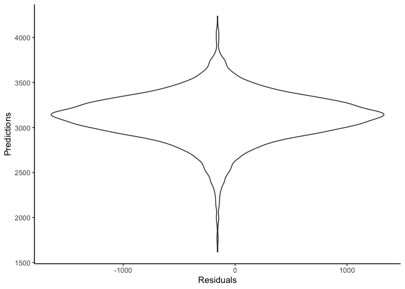

p8105\_hw6\_zc2443
================

# Problem 1

``` r
birthweight = read_csv("./data/birthweight.csv")
```

    ## Parsed with column specification:
    ## cols(
    ##   .default = col_double()
    ## )

    ## See spec(...) for full column specifications.

``` r
summary(birthweight) # there is no missing value in this dataset
```

    ##     babysex          bhead          blength           bwt      
    ##  Min.   :1.000   Min.   :21.00   Min.   :20.00   Min.   : 595  
    ##  1st Qu.:1.000   1st Qu.:33.00   1st Qu.:48.00   1st Qu.:2807  
    ##  Median :1.000   Median :34.00   Median :50.00   Median :3132  
    ##  Mean   :1.486   Mean   :33.65   Mean   :49.75   Mean   :3114  
    ##  3rd Qu.:2.000   3rd Qu.:35.00   3rd Qu.:51.00   3rd Qu.:3459  
    ##  Max.   :2.000   Max.   :41.00   Max.   :63.00   Max.   :4791  
    ##      delwt          fincome          frace          gaweeks     
    ##  Min.   : 86.0   Min.   : 0.00   Min.   :1.000   Min.   :17.70  
    ##  1st Qu.:131.0   1st Qu.:25.00   1st Qu.:1.000   1st Qu.:38.30  
    ##  Median :143.0   Median :35.00   Median :2.000   Median :39.90  
    ##  Mean   :145.6   Mean   :44.11   Mean   :1.655   Mean   :39.43  
    ##  3rd Qu.:157.0   3rd Qu.:65.00   3rd Qu.:2.000   3rd Qu.:41.10  
    ##  Max.   :334.0   Max.   :96.00   Max.   :8.000   Max.   :51.30  
    ##     malform            menarche        mheight          momage    
    ##  Min.   :0.000000   Min.   : 0.00   Min.   :48.00   Min.   :12.0  
    ##  1st Qu.:0.000000   1st Qu.:12.00   1st Qu.:62.00   1st Qu.:18.0  
    ##  Median :0.000000   Median :12.00   Median :63.00   Median :20.0  
    ##  Mean   :0.003455   Mean   :12.51   Mean   :63.49   Mean   :20.3  
    ##  3rd Qu.:0.000000   3rd Qu.:13.00   3rd Qu.:65.00   3rd Qu.:22.0  
    ##  Max.   :1.000000   Max.   :19.00   Max.   :77.00   Max.   :44.0  
    ##      mrace           parity            pnumlbw     pnumsga 
    ##  Min.   :1.000   Min.   :0.000000   Min.   :0   Min.   :0  
    ##  1st Qu.:1.000   1st Qu.:0.000000   1st Qu.:0   1st Qu.:0  
    ##  Median :2.000   Median :0.000000   Median :0   Median :0  
    ##  Mean   :1.627   Mean   :0.002303   Mean   :0   Mean   :0  
    ##  3rd Qu.:2.000   3rd Qu.:0.000000   3rd Qu.:0   3rd Qu.:0  
    ##  Max.   :4.000   Max.   :6.000000   Max.   :0   Max.   :0  
    ##      ppbmi            ppwt           smoken           wtgain      
    ##  Min.   :13.07   Min.   : 70.0   Min.   : 0.000   Min.   :-46.00  
    ##  1st Qu.:19.53   1st Qu.:110.0   1st Qu.: 0.000   1st Qu.: 15.00  
    ##  Median :21.03   Median :120.0   Median : 0.000   Median : 22.00  
    ##  Mean   :21.57   Mean   :123.5   Mean   : 4.145   Mean   : 22.08  
    ##  3rd Qu.:22.91   3rd Qu.:134.0   3rd Qu.: 5.000   3rd Qu.: 28.00  
    ##  Max.   :46.10   Max.   :287.0   Max.   :60.000   Max.   : 89.00

``` r
str(birthweight)
```

    ## Classes 'spec_tbl_df', 'tbl_df', 'tbl' and 'data.frame': 4342 obs. of  20 variables:
    ##  $ babysex : num  2 1 2 1 2 1 2 2 1 1 ...
    ##  $ bhead   : num  34 34 36 34 34 33 33 33 36 33 ...
    ##  $ blength : num  51 48 50 52 52 52 46 49 52 50 ...
    ##  $ bwt     : num  3629 3062 3345 3062 3374 ...
    ##  $ delwt   : num  177 156 148 157 156 129 126 140 146 169 ...
    ##  $ fincome : num  35 65 85 55 5 55 96 5 85 75 ...
    ##  $ frace   : num  1 2 1 1 1 1 2 1 1 2 ...
    ##  $ gaweeks : num  39.9 25.9 39.9 40 41.6 ...
    ##  $ malform : num  0 0 0 0 0 0 0 0 0 0 ...
    ##  $ menarche: num  13 14 12 14 13 12 14 12 11 12 ...
    ##  $ mheight : num  63 65 64 64 66 66 72 62 61 64 ...
    ##  $ momage  : num  36 25 29 18 20 23 29 19 13 19 ...
    ##  $ mrace   : num  1 2 1 1 1 1 2 1 1 2 ...
    ##  $ parity  : num  3 0 0 0 0 0 0 0 0 0 ...
    ##  $ pnumlbw : num  0 0 0 0 0 0 0 0 0 0 ...
    ##  $ pnumsga : num  0 0 0 0 0 0 0 0 0 0 ...
    ##  $ ppbmi   : num  26.3 21.3 23.6 21.8 21 ...
    ##  $ ppwt    : num  148 128 137 127 130 115 105 119 105 145 ...
    ##  $ smoken  : num  0 0 1 10 1 0 0 0 0 4 ...
    ##  $ wtgain  : num  29 28 11 30 26 14 21 21 41 24 ...
    ##  - attr(*, "spec")=
    ##   .. cols(
    ##   ..   babysex = col_double(),
    ##   ..   bhead = col_double(),
    ##   ..   blength = col_double(),
    ##   ..   bwt = col_double(),
    ##   ..   delwt = col_double(),
    ##   ..   fincome = col_double(),
    ##   ..   frace = col_double(),
    ##   ..   gaweeks = col_double(),
    ##   ..   malform = col_double(),
    ##   ..   menarche = col_double(),
    ##   ..   mheight = col_double(),
    ##   ..   momage = col_double(),
    ##   ..   mrace = col_double(),
    ##   ..   parity = col_double(),
    ##   ..   pnumlbw = col_double(),
    ##   ..   pnumsga = col_double(),
    ##   ..   ppbmi = col_double(),
    ##   ..   ppwt = col_double(),
    ##   ..   smoken = col_double(),
    ##   ..   wtgain = col_double()
    ##   .. )

``` r
birthweight = birthweight %>% 
  mutate(
    babysex = factor(babysex),
    frace = factor(frace),
    mrace = factor(mrace),
    malform = factor(malform)
  )

fit = lm(bwt ~ delwt + gaweeks + malform + momage + pnumlbw + pnumsga + ppbmi + ppwt + smoken + wtgain,
         data = birthweight) 

fit %>% broom::tidy()
```

    ## # A tibble: 8 x 5
    ##   term        estimate std.error statistic   p.value
    ##   <chr>          <dbl>     <dbl>     <dbl>     <dbl>
    ## 1 (Intercept)   -39.6     97.1     -0.407  6.84e-  1
    ## 2 delwt           9.84     0.625   15.7    2.26e- 54
    ## 3 gaweeks        58.6      2.16    27.1    8.00e-150
    ## 4 malform1       -1.32   114.      -0.0116 9.91e-  1
    ## 5 momage         12.5      1.76     7.10   1.42e- 12
    ## 6 ppbmi         -26.7      4.05    -6.59   5.08e- 11
    ## 7 ppwt           -1.92     0.912   -2.11   3.53e-  2
    ## 8 smoken         -7.78     0.906   -8.58   1.27e- 17

``` r
birthweight %>% 
  add_residuals(fit) %>% 
  add_predictions(fit) %>% 
  ggplot(aes(x = resid, y = pred)) +
  geom_violin() +
  labs(
    x = "Residuals",
    y = "Predictions"
  ) +
  theme_classic()
```

    ## Warning in predict.lm(model, data): prediction from a rank-deficient fit
    ## may be misleading
    
    ## Warning in predict.lm(model, data): prediction from a rank-deficient fit
    ## may be misleading

<!-- -->
